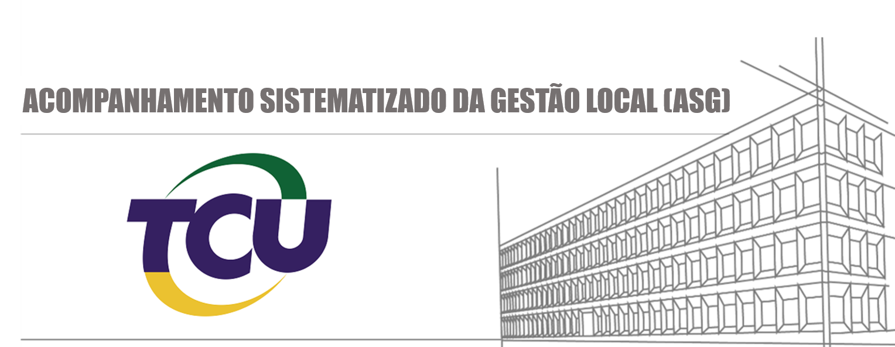

## Descrição do projeto

>    Este projeto tem por objetivo apresentar informações sobre os recursos federais destinados ao estado da Paraiba, permitindo o acompanhameto do repasse feitos aos municipios de forma detalhada.

## Origem dos dados dados 

>  - [Portal da transparencia](http://www.portaltransparencia.gov.br/download-de-dados/transferencias)
  
  
  | COLUNA 	| DESCRIÇÃO 	|
  |--------------------	|-----------------------------------------------------------------------------------------------------------------------------	|
  | Tipo Transferência 	| ‘Constitucionais e Royalties’; ‘Legais’; ‘Voluntárias e Específicas’; ‘Direta ao Cidadão’; ‘Múltiplo’ 	|
  | Tipo Favorecido 	| Informa o tipo do favorecido da transferência (Pessoa Física, Administração Pública, Entidades sem Fins Lucrativos, etc.) 	|
  | Nome Município 	| Nome do município do favorecido do recurso transferido. 	|
  | Nome Função 	| Nome da Função em que foi classificada a despesa. 	|
  | Código Programa 	| Código do Programa em que foi classificada a despesa.    Toda ação do Governo está estruturada em programas orientados para a realização dos objetivos estratégicos definidos para o período do PPA, ou seja, quatro anos.    - Programa Temático: aquele que expressa e orienta a ação governamental para a entrega de bens e serviços à sociedade;    - Programa de Gestão, Manutenção e Serviços ao Estado: aquele que expressa e orienta as ações destinadas ao apoio, à gestão e à manutenção da atuação governamental.    Fonte: Manual Técnico do Orçamento 	|
  | Nome Programa 	| Nome do Programa em que foi classificada a despesa.    Fonte: Manual Técnico do Orçamento 	|
  | Código Ação 	| Código da ação orçamentária em que foi classificada a despesa.    Ação Orçamentária: Operação da qual resultam produtos (bens ou serviços) que contribuem para atender ao objetivo de um programa. Incluem-se também no conceito de ação as transferências obrigatórias ou voluntárias a outros entes da Federação e a pessoas físicas e jurídicas, na forma de subsídios, subvenções, auxílios, contribuições, entre outros, e os financiamentos.    Fonte: Manual Técnico do Orçamento 	|
  | Nome Ação 	| Nome da ação orçamentária em que foi classificada a despesa. 	|
  | Linguagem Cidadã 	| Linguagem Cidadã: Nomes mais intuitivos pelos quais as ações governamentais são apresentadas aos cidadãos. Exemplo: Transferência de Renda Diretamente às Famílias em Condição de Pobreza e Extrema Pobreza (Bolsa Família). 	|
  | Código Favorecido 	| Código do favorecido do pagamento realizado.    Favorecidos: Entes governamentais, entidades sem fins   lucrativos, demais pessoas jurídicas ou pessoas físicas que receberam   transferências de recursos públicos federais, independentemente da origem   desses valores.    Fonte: Controladoria-Geral da União 	|
  | Nome Favorecido 	| Nome do favorecido do pagamento realizado 	|
  | Valor Transferido 	| Valor da Transferência 	|

